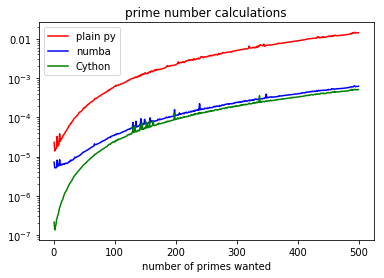
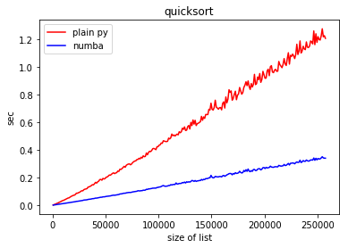
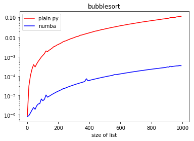
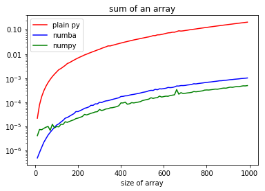

# Profiling and the need for speed

## GDSP Conference 2018

#### T. Manassis    
##### [_TheodoreM_](https://twitter.com/_TheodoreM_) on 

#### Big Data team , ONS

a very quick demo of some ways to identify bottlenecks in Python code and ways to speed up these hotspots.

 

this repo includes :

* [jupyter notebook](https://github.com/ONSBigData/GDSP18_ProfilingOptimizingPyDemo/blob/master/01-profiling.ipynb) with code and some comments
* Text version [overview](https://github.com/ONSBigData/GDSP18_ProfilingOptimizingPyDemo/blob/master/00-TLDR.md)
* jupyter notebook with plain python , cython and numba example [comparison](https://github.com/ONSBigData/GDSP18_ProfilingOptimizingPyDemo/blob/master/03-Cython_examples.ipynb)
* jupyter notebook with showing how to include fortran code to be called as a python functionon a notebook [comparison](https://github.com/ONSBigData/GDSP18_ProfilingOptimizingPyDemo/blob/master/04-fortran_in_python.ipynb)

Feel free to fork , add content and then do a pull request

